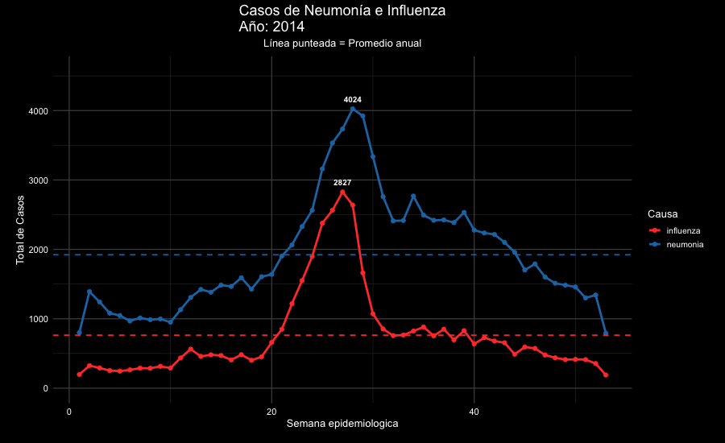
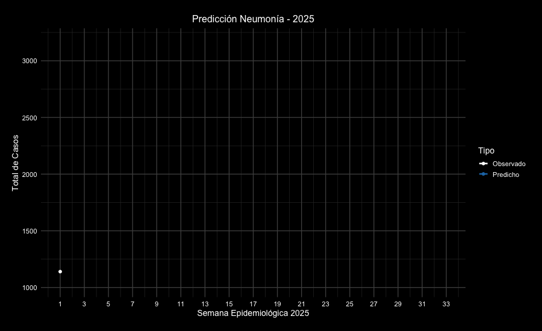
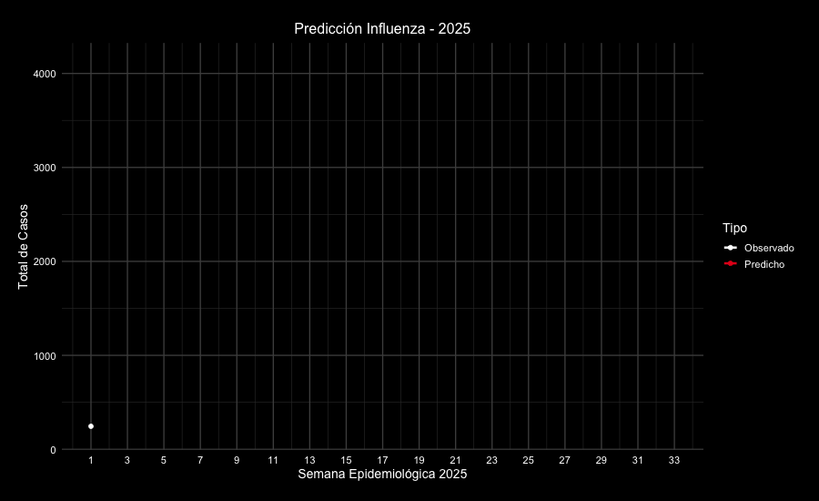
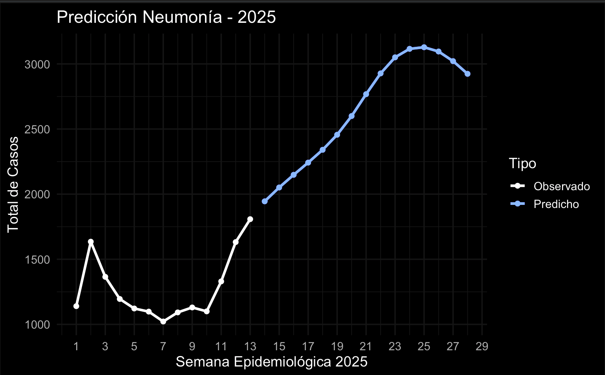
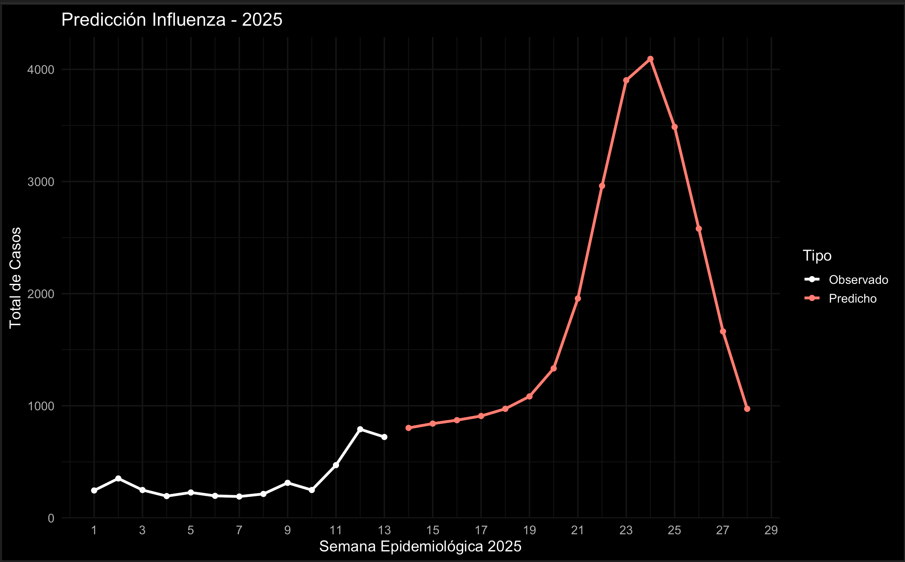

# 📊 Predicción de atenciones de urgencia por causas respiratorias (2014–2025)

Publicado oficialmente en [datos.gob.cl](https://datos.gob.cl/data_reuse/9be39c49-ce4e-4d73-b43a-5f0aed4c4bfa)

Este proyecto analiza datos históricos de atenciones de urgencia por causas respiratorias en Chile desde 2014 hasta 2025, y utiliza un modelo de redes neuronales autorregresivas para predecir la evolución de los casos por semana epidemiológica. Los datos provienen del Sistema de Atención Diaria de Urgencias (SADU), disponibles en [datos.gob.cl](https://datos.gob.cl).

El objetivo es explorar hasta qué punto un modelo relativamente simple puede anticipar los peaks estacionales de invierno, información relevante para la planificación de camas y personal en servicios de urgencia.

---

## 📁 Datos

- **Fuente:** [datos.gob.cl](https://datos.gob.cl) — Sistema de Atención Diaria de Urgencias (SADU)
- **Cobertura:** semanas epidemiológicas desde 2014 hasta 2025
- **Enfermedades analizadas:** Neumonía (J12–J18) e Influenza (J09–J11)
- **Filtro aplicado:** solo atenciones en establecimientos tipo `Hospital` (no incluye SAPU, SAR ni otros niveles de urgencia de la red). El dato de origen tiene `"Hospital"` y `"Hospital "` (con espacio final) como valores separados; el script normaliza con `trimws()` antes de filtrar para no perder ~2% de los casos por esa inconsistencia
- **Carga:** el script descarga el dataset en formato `.parquet` directamente desde la URL pública de datos.gob.cl al ejecutarse — no requiere archivos locales ni pasos manuales de descarga

---

## ⚙️ Metodología

- Se construyen dos series temporales semanales (Neumonía e Influenza) con `frequency = 52`.
- Se ajusta un modelo **`nnetar`** (red neuronal autorregresiva, paquete `forecast` en R) para cada causa.
- Se generan predicciones a 20 semanas.
- Se evalúa el modelo de dos formas:
  - **In-sample:** `accuracy()` sobre el modelo final, entrenado con todos los datos disponibles. Mide qué tan bien el modelo explica el pasado.
  - **Out-of-sample (backtesting):** se reserva el último año (52 semanas) como conjunto de prueba, se entrena un modelo solo con los datos anteriores y se compara la predicción contra datos reales que el modelo nunca vio. Esta es la métrica que refleja capacidad predictiva real.

**Nota metodológica:** los dos números son deliberadamente distintos y no deben confundirse. El in-sample es sistemáticamente optimista porque el modelo ya "vio" esos datos al ajustarse; el out-of-sample es la medida honesta de qué tan bien predeciría un año nuevo. Ver la comparación completa en [Resultados](#-resultados).

---

## 📈 Resultados

| Causa | MAE in-sample | MAPE in-sample | MAE out-of-sample (real) | MAPE out-of-sample (real) |
|---|---|---|---|---|
| Neumonía | 147,9 | 10,63% | 563,08 | **50,87%** |
| Influenza | 88,99 | 23,43% | 490,05 | **60,15%** |

El contraste es la conclusión más importante del proyecto: el modelo se ve bastante bien ajustando datos que ya conoce (MAPE ~10–23%), pero al probarlo contra un año completo que nunca vio, el error real sube a 51–60%. `nnetar` captura razonablemente la forma estacional, pero se equivoca de forma considerable en la magnitud y el momento exacto del peak cuando predice "a ciegas". Esta brecha es la razón por la que el proyecto ahora reporta ambas métricas en vez de solo la in-sample — ver la nota metodológica arriba y las limitaciones más abajo.

En la ejecución original (8 de abril de 2025, con los datos disponibles hasta esa fecha), el modelo proyectó para la temporada 2025:

- **Neumonía:** un peak cercano a los **3.200 casos** hacia la semana epidemiológica 24–25 (≈ fines de junio).
- **Influenza:** un peak superior a los **4.100 casos** hacia la semana epidemiológica 24, con una curva más angosta y pronunciada que la de neumonía.

Estas cifras y las animaciones de abajo corresponden a ese snapshot congelado. Como el script carga los datos en vivo desde datos.gob.cl, volver a ejecutarlo hoy no reproduce esta misma ventana de predicción — genera el forecast a 20 semanas desde la última semana disponible *en ese momento*, que avanza junto con el dataset. Más detalle en [Limitaciones](#-limitaciones).

### Visualizaciones

**Comportamiento histórico por semana epidemiológica (2014–2025)**



**Predicción 2025 — Neumonía** (observado vs. predicho)



**Predicción 2025 — Influenza** (observado vs. predicho)



**Predicción con intervalo de confianza (salida nativa de `forecast()`)**

| Neumonía | Influenza |
|---|---|
|  |  |

---

## ⚠️ Limitaciones

- **Error real alto fuera de muestra:** el backtesting muestra un MAPE de 51–60% al predecir un año completo no visto por el modelo, muy por sobre el 10–23% in-sample. El modelo es útil para anticipar la forma estacional, pero no debería usarse como fuente única para decisiones operativas (dotación, camas) sin margen de error amplio.
- **El dataset se carga en vivo, el forecast "se mueve":** el script pide los datos más recientes disponibles en datos.gob.cl y predice 20 semanas *desde la última semana disponible en el momento de ejecución*. Las cifras y animaciones de la sección de Resultados corresponden a un snapshot congelado del 8 de abril de 2025; ejecutar el script en otra fecha genera una ventana de predicción distinta (más adelante en el tiempo), no una repetición de esos mismos números. Para reproducir exactamente el snapshot original haría falta fijar el dataset a una fecha de corte, algo que el script no hace hoy.
- **Efecto pandemia (2020–2021):** la serie muestra una caída drástica y sostenida de casos durante ese período, atribuible a las medidas de distanciamiento social y uso de mascarillas durante la pandemia de COVID-19. El modelo no incorpora ningún tratamiento explícito de esta discontinuidad estructural, lo que puede afectar cómo pondera la estacionalidad de años recientes.
- **Cobertura parcial:** el análisis considera solo establecimientos tipo `Hospital`. No representa la totalidad de la red de urgencia (SAPU, SAR, etc.).
- **Aproximación de frecuencia semanal:** se fija `frequency = 52` para todos los años. Los años con 53 semanas epidemiológicas pueden introducir un leve desfase estacional acumulado a lo largo de una serie de más de 10 años.
- **Sin comparación contra modelos base:** no se contrastó `nnetar` frente a alternativas más simples (ARIMA, ETS, estacional ingenuo) dentro de este script, por lo que no hay evidencia publicada de que la red neuronal sea superior a un enfoque más simple para esta serie.

---

## 🧰 Tecnologías y librerías

- `R`
- `forecast`
- `ggplot2`
- `gganimate`
- `dplyr`
- `arrow`
- `janitor`
- `scales`

---

## ▶️ Cómo ejecutar

```r
# Instalar dependencias (una vez)
install.packages(c("tidyverse", "arrow", "janitor", "forecast",
                    "tseries", "gganimate", "scales", "gifski"))

# Ejecutar el script completo
Rscript series_de_tiempo_enfermerdades_respiratorias.R
```

`gganimate` requiere el paquete `gifski` instalado para renderizar las animaciones a `.gif`. El script descarga los datos directamente desde datos.gob.cl, por lo que no depende de rutas locales.

---

## 📁 Estructura del proyecto

```
├── series_de_tiempo_enfermerdades_respiratorias.R   # Script principal
├── img/                                              # Visualizaciones generadas
└── README.md
```

---

## 🔗 Fuente de datos

- [Atenciones de urgencia respiratoria semanal — SADU](https://datos.gob.cl/dataset/606ef5bb-11d1-475b-b69f-b980da5757f4)

---

## 👤 Autor

**Felipe Muñoz**
Tecnólogo Médico | Codificador & Auditor GRD Senior | Health Data Science
[LinkedIn](https://www.linkedin.com/in/felipe-m-92123990) · [Proyecto en datos.gob.cl](https://datos.gob.cl/data_reuse/9be39c49-ce4e-4d73-b43a-5f0aed4c4bfa)

---

## 📌 Licencia

Este proyecto está bajo licencia MIT/CC BY-SA. Incluye datos públicos de libre acceso, procesados con fines educativos y analíticos.
